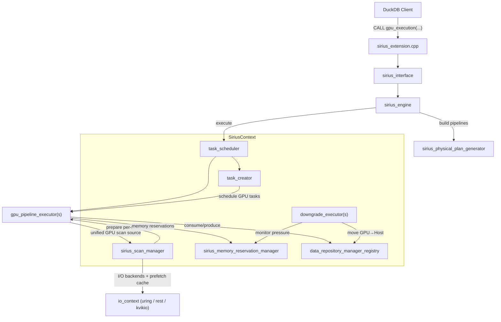

# Architecture Overview

This document describes the high-level architecture of Super Sirius, including component ownership, thread model, and execution lifecycle.

## Component Diagram



## Ownership Hierarchy

`SiriusContext` (`src/sirius_context.hpp`) is shared by connections to one DuckDB DatabaseInstance. Connection-local state holds settings and planning captures; each execution owns its engine and query:

```
SiriusContext
├── sirius_config                       # Configuration (thread counts, memory sizes, operator params)
├── sirius_memory_reservation_manager   # GPU/Host/Disk memory management via cuCascade
├── small_pinned_host_memory_resource   # Pinned host memory allocator
├── data_repository_manager_registry    # One repository manager per query
├── query_admission                     # Query/planning/maintenance permits
├── query_lifecycle_registry            # Publication gates, work leases and retained plans
├── task_scheduler                      # Top-level executor (owns the GPU pipeline executors)
├── sirius_scan_manager                 # Scan-side preparation + I/O (io_context, prefetch cache, split providers)
├── downgrade_executor[]                # Per-memory-space monitors for GPU→Host spilling
├── task_creator                        # Creates GPU pipeline tasks based on data availability
└── per-query scan/creator state         # Registered and retired by query ID
```

Key lifecycle methods on `SiriusContext`:
- `initialize()` — initializes all subsystems with config
- `terminate()` — releases all resources
- `QueryBegin()` / `QueryEnd()` — DuckDB query lifecycle hooks
- `create_query()` — returns an execution-owned query with pipeline metadata
- `StandaloneQueryScope` — owns admission and query-specific registration/retirement

See [Concurrent queries](concurrent-queries.md) and [Query lifetime](query-lifecycle.md) for
work ownership, cancellation, and exclusive maintenance.

Scans are not a separate executor. A unified `sirius_gpu_scan_operator` (operator type `GPU_SCAN`) is the pipeline source: it pulls splits from a `split_connector` and delegates per-split materialization to an installed `gpu_ingestible` (parquet or duckdb-native today). The `sirius_scan_manager` prepares this state per query — it builds the per-table ingestible, installs the split connector, drives a `split_provider`, and owns the I/O backends (an `io_context` over io_uring plus optional REST/kvikio paths) and the prefetching cache.

## Thread Model

Super Sirius uses multiple dedicated thread pools, each with a specific role:

```
┌─────────────────────────────────────────────────────────────────┐
│  DuckDB Query Thread (main)                                     │
│  - Parses SQL, generates logical plan                           │
│  - Calls sirius_interface → sirius_engine                       │
│  - Builds pipelines (single-threaded)                           │
│  - Calls task_scheduler.start_query()                           │
│  - Blocks on future until query completes                       │
└─────────────────────────────────────────────────────────────────┘

┌─────────────────────────────────────────────────────────────────┐
│  Pipeline Executor Management Thread                            │
│  - Runs management_eventloop()                                  │
│  - Listens on task_request_channel for GPU executor requests    │
│  - Dequeues pipeline tasks and routes to GPU executors           │
└─────────────────────────────────────────────────────────────────┘

┌─────────────────────────────────────────────────────────────────┐
│  GPU Pipeline Executor (per GPU device)                         │
│  - Manager thread: acquires kiosk ticket → requests task →      │
│    reserves memory → dispatches to worker thread pool            │
│  - Worker threads: execute GPU pipeline tasks (including the     │
│    unified GPU scan source) on dedicated CUDA streams           │
└─────────────────────────────────────────────────────────────────┘

┌─────────────────────────────────────────────────────────────────┐
│  Task Creator Thread Pool                                       │
│  - Manager loop: pops from task_creation_queue                  │
│  - Follows hint chain to find ready operators                   │
│  - Creates GPU pipeline tasks                                   │
└─────────────────────────────────────────────────────────────────┘

┌─────────────────────────────────────────────────────────────────┐
│  Scan Manager                                                   │
│  - Worker thread pool: per-scan preparation                    │
│  - Driver thread: runs split providers sequentially, feeding    │
│    splits into each scan operator's split_connector            │
│  - I/O reactor threads: io_uring (local disk) and REST/kvikio   │
│    backends behind the io_context, plus the prefetching cache   │
└─────────────────────────────────────────────────────────────────┘

┌─────────────────────────────────────────────────────────────────┐
│  Downgrade Executor(s) (per memory space)                       │
│  - Monitor thread: polls memory pressure                        │
│  - Manager thread: dispatches downgrade tasks                   │
│  - Worker threads: move data GPU→Host                           │
└─────────────────────────────────────────────────────────────────┘
```

## Execution Lifecycle

A query through Super Sirius follows these steps:

1. **Parse & Optimize** — DuckDB parses the SQL string and produces an optimized logical plan
2. **Physical Plan Generation** — `sirius_physical_plan_generator::create_plan()` converts the DuckDB logical plan into a Sirius physical operator tree
3. **Engine Initialization** — `sirius_engine::initialize()` builds the pipeline graph:
   - Constructs `sirius_meta_pipeline` from the physical plan via `build()` + `ready()`
   - Splits operators (TABLE_SCAN, joins, aggregates, sorts) into multiple pipelines
   - Converts each TABLE_SCAN source into a unified GPU scan source with a per-table `gpu_ingestible`
   - Injects PARTITION, CONCAT, MERGE operators at pipeline boundaries
   - Wires data repositories between pipelines with barrier types
4. **Query Preparation** — `sirius_engine::execute()` creates this query's `completion_handler` and future. `SiriusContext::create_query()` passes the handler to `task_creator::prepare_for_query()`, which makes it available to the query's pipeline tasks, while `sirius_scan_manager::prepare_for_query()` registers per-query scan state, builds split providers, and matches pinned-cache entries
5. **Query Start** — `task_scheduler::start_query(query)` schedules the initial scan operator; the engine waits on the future it already owns
6. **Scan Phase** — The scan manager drives split providers that pull bytes through the `io_context` (io_uring locally, or REST/kvikio backends) and the prefetching cache; the unified GPU scan source consumes splits and materializes GPU-ready batches into data repositories
7. **Pipeline Execution** — GPU executor threads pull tasks from the queue, acquire memory reservations, and call `execute()` on every operator in the pipeline (source through sink) on CUDA streams, then call the sink's `sink()` to push results downstream
8. **Task Creation** — After each task completes, the task creator is notified to schedule downstream consumers based on data availability in ports
9. **Memory Management** — Downgrade executors monitor GPU memory pressure and spill data to host memory when thresholds are exceeded
10. **Completion** — A query-terminal pipeline signals the completion future when it transitions to finished; the GPU task epilogue may also signal it safely
11. **Result Extraction** — The main thread extracts the `MaterializedQueryResult` from the result collector and returns it to DuckDB

## Key Source Files

| File | Role |
|------|------|
| `src/sirius_context.hpp` | Ownership hierarchy, subsystem lifecycle |
| `src/sirius_extension.cpp` | Extension registration, table functions, config |
| `src/sirius_interface.cpp` | DuckDB-facing API, query lifecycle |
| `src/sirius_engine.cpp` | Pipeline construction, execution orchestration |
| `src/planner/sirius_physical_plan_generator.cpp` | Logical-to-physical plan translation |
| `src/pipeline/task_scheduler.hpp` | Top-level executor (owns GPU executors) |
| `src/pipeline/gpu_pipeline_executor.hpp` | Per-GPU task executor |
| `src/creator/task_creator.hpp` | Task creation and scheduling |
| `src/op/scan/sirius_gpu_scan_operator.hpp` | Unified GPU scan source operator |
| `src/op/scan/gpu_ingestible.hpp` | Per-format split materialization (parquet, duckdb-native) |
| `src/scan_manager/sirius_scan_manager.hpp` | Per-scan preparation, split providers, I/O ownership |
| `src/io/io_context.hpp` | I/O backends (uring / rest / kvikio) + prefetch cache |
| `src/downgrade/downgrade_executor.hpp` | Memory spilling |
| `src/memory/sirius_memory_reservation_manager.hpp` | Memory management |
