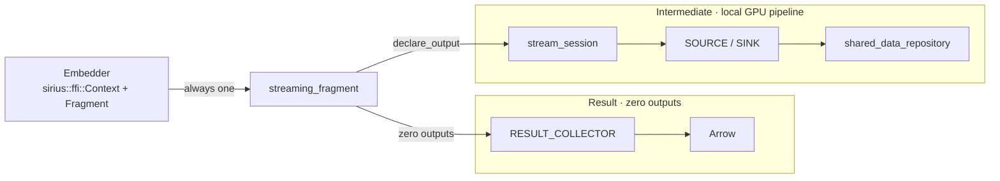

# Fragments

A fragment is one runnable piece of a query: a bound plan, the input and output streams it
declares, and the code that builds, runs, and drains it. [Streaming
Sessions](streaming-sessions.md) covers the primitives underneath (`exec::batch_stream`,
`STREAMING_SOURCE` / `STREAMING_SINK`, `exec::stream_session`). This document covers how a plan
becomes a fragment, how declared streams get a schema before bind, and how `relay_from()` chains
fragments.

The **embedder** is the process that embeds Sirius through `sirius::ffi::Context` plus
`sirius::ffi::Fragment` (the Rust compute node, C++ tests).

| | `exec::streaming_fragment` | `sirius::ffi::Fragment` |
|---|---|---|
| **Files** | `src/exec/streaming_fragment.{hpp,cpp}` | `include/sirius/ffi.hpp`, `src/sirius_ffi.cpp` |
| **Caller** | C++ with a live `duckdb::ClientContext`: `sirius::ffi` and tests | Code that must not include DuckDB or cuDF headers, such as the Rust bindings |
| **Connection** | Borrows the caller's `ClientContext` | `Context` owns an embedded `duckdb::DuckDB` and `Connection` |
| **Transaction** | The caller supplies one for `build()` and `run()` | `build()` and `run()` each run in their own |
| **Query window** | `run()` opens and closes it | Same; `Fragment` forwards to `streaming_fragment` |

`sirius::ffi::Fragment` and `Context::execute_substrait` hold no plan of their own: both lower
Substrait and hand it to one `streaming_fragment`, which builds either terminal.



## Quick path

```cpp
// exec::streaming_fragment: the caller owns the DuckDB transaction.
fragment_spec spec;
spec.plan_source = my_plan_source;     // ClientContext& -> bound_plan
spec.outputs     = {0};                // omit for a result fragment
streaming_fragment frag(client, std::move(spec));
frag.build();                          // plans; holds the slot only for create_plan
frag.run();                            // opens the query window, blocks, closes it
drain(frag, 0);                        // pull() until drained
```

```cpp
// Embedder: owns the connection.
auto ctx = make_context();
auto sender = make_fragment(*ctx);
sender->declare_output(0);
sender->build(substrait_plan_bytes);

auto receiver = make_fragment(*ctx);   // may be built before the sender runs
receiver->declare_input_column(0, "a", "BIGINT");
receiver->build(other_plan_bytes);     // reads view sirius_stream_0

sender->run();
receiver->relay_from(*sender, /*source_stream_id=*/0, /*input_stream_id=*/0, /*sender_id=*/0);
receiver->run();                       // every input must be closed; relay_from closed sender 0
```

## `stream_bind_catalog` and `sirius_stream_source`

**Files:** `src/exec/stream_bind_catalog.{hpp,cpp}`, `src/exec/stream_plan_bindings.{hpp,cpp}`

Input streams are not DuckDB tables, so the binder has nothing to look up.
`sirius_stream_source(id)` is a table function that stands in: bind resolves the declared names
and types, the body never runs, and the physical plan generator replaces the scan with a
`STREAMING_SOURCE`. Plans read it through a view, whose name `stream_view_name(id)` returns:

```sql
CREATE OR REPLACE VIEW main.sirius_stream_<id> AS SELECT * FROM sirius_stream_source(<id>)
```

Bind and physical planning both look up the schema in `stream_bind_catalog`, a per-connection
`duckdb::ClientContextState`:

```cpp
class stream_bind_catalog : public duckdb::ClientContextState {
 public:
  static constexpr const char* kStateKey = "sirius_stream_catalog";
  void declare(stream_id_t id, stream_input_binding binding);  // overwrites same-id entry
  void erase(stream_id_t id);                                   // no-op if absent
  const stream_input_binding& get(stream_id_t id) const;        // @throws if undeclared
  void set_built(stream_id_t id, op::sirius_physical_streaming_source* built);
};

duckdb::shared_ptr<stream_bind_catalog> catalog_for(duckdb::ClientContext& context);
```

```
streaming_fragment::build()      ── declare(id) ──►  catalog
stream_source_bind()             ◄── get(id) ──      catalog   (DuckDB bind)
create_streaming_source_plan()   ◄── get(id) ──      catalog   (builds STREAMING_SOURCE, set_built)
streaming_fragment::build()      ◄── get(id).built   → session add_source(id, *built)
streaming_fragment::build() exit ── erase(id) ──►    catalog   (success or failure)
```

`create_plan()` does not return the operator to the fragment layer; `set_built()` is how it reaches
the session.

- **A declaration lives only for its fragment's `build()`.** `build()` erases its ids on every
  exit, so fragments on one connection can reuse an id without seeing a stale schema.
- **A declared stream may be read by at most one plan leaf.** `set_built()` rejects a second bind.
  Otherwise the first leaf would never see a push or close, and its pipeline would wait forever.
  Give each reader its own stream id.
- **The catalog must exist before bind.** `SiriusContextExtensionCallback::OnConnectionOpened`
  installs it on transparent-path connections (and removes it on close);
  `sirius::ffi::Context::Impl::bring_up()` installs it for the embedder. Without it, `catalog_for()`
  throws.

## `exec::streaming_fragment`

```cpp
struct bound_plan {
  duckdb::unique_ptr<duckdb::LogicalOperator> plan;
  duckdb::shared_ptr<duckdb::PreparedStatementData> prepared;  // optional; result names/types
};

struct fragment_spec {
  logical_plan_source plan_source;                   // ClientContext& -> bound_plan, called once
  std::map<stream_id_t, stream_input_spec> inputs;    // schema + expected senders per input
  std::vector<stream_id_t> outputs;                   // outputs[i] = partition i; empty = result
  std::optional<op::partition_spec> partitioning;     // illegal when outputs.size() < 2
};
```

**Constructor.** A plan source is required. Empty `outputs` is a `RESULT_COLLECTOR`. More than one
output requires `partitioning` (a gather to N outputs would leave N-1 empty). `partitioning` on
fewer than two outputs is rejected, so `declare_output_broadcast()` or `declare_output_hash_key()`
on 0 or 1 outputs fails at `build()` instead of silently routing every row to one destination.

**`build()`** declares the inputs on fresh repositories, runs `plan_source`, generates the
physical plan, and roots it in a `sirius_physical_streaming_sink` or
`sirius_physical_materialized_collector`. The root waits in `_plan_root` until `run()`.

- **No query window.** It holds the query-lifecycle slot (`SlotGuard`) only around
  `create_plan()`, which reads the pinned-table registry, and records that registry's epoch. The
  transparent path usually plans this way too, but re-plans inside the window when the epoch
  changed or a prepared statement executes again. Any number of fragments can be built before any runs.
- **A failed `build()` cannot be retried.** The session keeps partial registrations; create a new
  fragment.
- **Every declared input must be read by the plan.** An unread input throws; nothing would ever
  close it.
- **`prepared` types must match the plan's output types**, because the collector decodes GPU
  output with them. One exception: HUGEINT over a BIGINT plan column. DuckDB types `SUM(BIGINT)` as
  HUGEINT, the planner narrows it to BIGINT, and the collector casts it back.
- **Hash-key cast types.** cuDF `murmur3` hashes raw bytes, so an `INT32` and an `INT64` sender
  would split matching keys. When `partitioning.key_cast_types` is empty, `build()` fills one per
  key: `TINYINT`, `SMALLINT`, `INTEGER` → `INT64`; `BIGINT`, `BOOLEAN`, `VARCHAR` → `EMPTY` (as-is);
  `DECIMAL` → `FLOAT64`; any other type throws. An out-of-range key column throws first.

**`run()`**

- Requires every input closed; otherwise it throws and the fragment stays runnable. Waiting inside
  the window would block every other query on the engine.
- Opens a `StandaloneQueryScope`, rejects the plan if a table was pinned or unpinned since
  `build()`, builds the `sirius_engine` on the window's query id, executes, and calls `finish()`
  before returning. Another fragment's concurrent `run()` waits for the slot; a second `run()` of
  the same fragment throws.
- On an exception it poisons every output, then closes the window and rethrows; otherwise a peer
  in `wait()` would block forever (the S2/S3 hazard in
  [Streaming Sessions](streaming-sessions.md#execbatch_stream)). A result whose `QueryResult`
  carries an error also fails the run. A failed `run()` is final, and `pull()` rethrows its cause.
- After `run()` the engine owns the plan and the fragment owns the engine, so outputs stay
  pullable; query-window cleanup does not destroy them.

Do not open a `StandaloneQueryScope` around `build()` or `run()`: on the same thread both fail
with "nested execution window"; on another thread they wait for the slot.

**`relay_from(source, source_stream, input_stream, sender)`** moves every batch parked on
`source`'s output into this fragment's input, then closes `sender`. Before anything moves it
checks: both fragments built, the source has run successfully, this fragment has not run, a shared
`ClientContext`, the source is not a result fragment, the input is declared, the sender is in the
input's expected set (when one is declared), and column count and types match
`source.sink_types()`. The source must have run because "nothing parked" on an open stream looks
the same as "ended"; relaying early would close the input after zero batches. One failure comes
after a batch moves: if the input already ended, the first push is refused and that batch is lost.
`pull`, `close_input`, and `drained` wrap the session, which is not public.

**Member declaration order is the lifetime contract** (C++ destroys in reverse; reordering is a
use-after-free): repositories, then `_result_plan` (a `RESULT_COLLECTOR` references it), then
`_plan_root` and the engine (one owns the plan, whose operators the session points at), then
`_session`, which is destroyed first.

## Embedder API: `sirius::ffi::Context` plus `Fragment`

**Files:** `include/sirius/ffi.hpp`, `src/sirius_ffi.cpp`

`Context` owns one engine (`duckdb::SiriusContext`), an embedded `duckdb::DuckDB` plus
`Connection`, and a `stream_bind_catalog`, shared by every `Fragment` from `make_fragment()`.
`Fragment` is a PIMPL around one `streaming_fragment` and keeps only its declarations; built, run,
and result state, the relay checks, and output poisoning all live in `streaming_fragment`. No
declared output means a result fragment, drained with `result_to_arrow()`.

```
build():  ┌─ in_transaction ──────────────────────────────────────────────────┐
          │ resolve_inputs()           type-name parsing needs a catalog lookup
          │ streaming_fragment ctor    validates outputs and partition mode
          │ streaming_fragment::build()
          │   declare inputs; plan source: create_stream_views(), lower_substrait()
          │   create_plan under the slot; erase the declared ids
          └───────────────────────────────────────────────────────────────────┘
run():    ┌─ in_transaction ─ streaming_fragment::run() ───────────────────────┐
          └───────────────────────────────────────────────────────────────────┘
```

- **One transaction each.** Type-name parsing, `CREATE VIEW`, lowering, and scans (which read
  DuckDB MVCC state) need one. `execute_substrait` wraps build, run, and `take_result()` in a single
  transaction. Views are created after `build()` declares the streams, so they bind against the
  real schemas.
- **Rollback on failure.** `in_transaction(serial, conn, body)` commits on success and otherwise
  rolls back and rethrows the original error, even if the rollback fails. Rolling back discards
  views a failed `build()` already created. The `streaming_fragment` is handed to `Fragment` only
  after the commit, so a failed FFI `build()` leaves the `Fragment` unbuilt and retryable.
- **One transaction at a time per `Context`.** Fragments share the connection, and a second
  `BEGIN` would fail and invalidate the open transaction. `in_transaction` holds the `Context`'s
  `conn_mutex`, so concurrent `build()`, `run()`, and `execute_substrait` calls wait for each other.

`run()` holds a query admission permit through execution and retirement. `build()` does not
retain one. The FFI Context still serializes its connection; concurrent SQL admission does not
establish a concurrent streaming producer/consumer contract.

## Tests

| File | Catch2 tags | Covers |
|---|---|---|
| `test/cpp/exec/test_stream_bind_catalog.cpp` | `[stream_bind_catalog]` | Catalog verbs |
| `test/cpp/exec/test_streaming_fragment.cpp` | `[integration][streaming_fragment]`, `[integration][streaming_fragment_control]` | Spec errors; relay preconditions (FRAG-7); failed runs and single-use calls (FRAG-8); hash partitioning (FRAG-9), with INTEGER and BIGINT senders (FRAG-9b); out-of-order builds and runs (FRAG-10); a window between `build()` and `run()` (FRAG-11); `run()` guards (FRAG-12); runs from two threads (FRAG-13) |
| `test/cpp/exec/test_sirius_ffi_embedder.cpp` | `[isolated_context][sirius_ffi]` | Public FFI with Substrait built in the test: leaf result, `relay_from` chain, builds before runs (one and two threads), `build()` and `run()` on different threads, drop after `build()`, a failed `build()`, a hash key on one output, concurrent `run()` and `execute_substrait` |
| `test/cpp/exec/test_sirius_ffi_fragment.cpp` | `[isolated_context][sirius_ffi]` | Rollback of a `build()` that fails while resolving input types |

`[isolated_context]` tests bring up their own `SiriusContext` and GPU pools; the listener in
`test/cpp/unittest.cpp` pauses the shared test environments around them.

## Not yet ported

`Fragment::run()` blocks until `sirius_engine::execute()` finishes, so fragments run
store-and-forward and every input must be closed first. `relay_from()` only moves batches parked
on a finished local source. Remote senders need `push_arrow`, `pull_arrow`, and `drained` on
`sirius::ffi::Fragment`, plus non-blocking execution, tracked in
[#1590](https://github.com/sirius-db/sirius/issues/1590).
